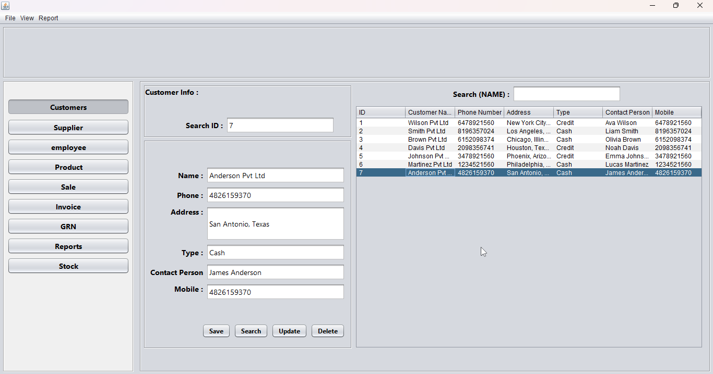
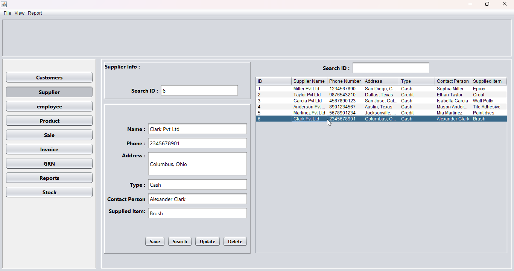
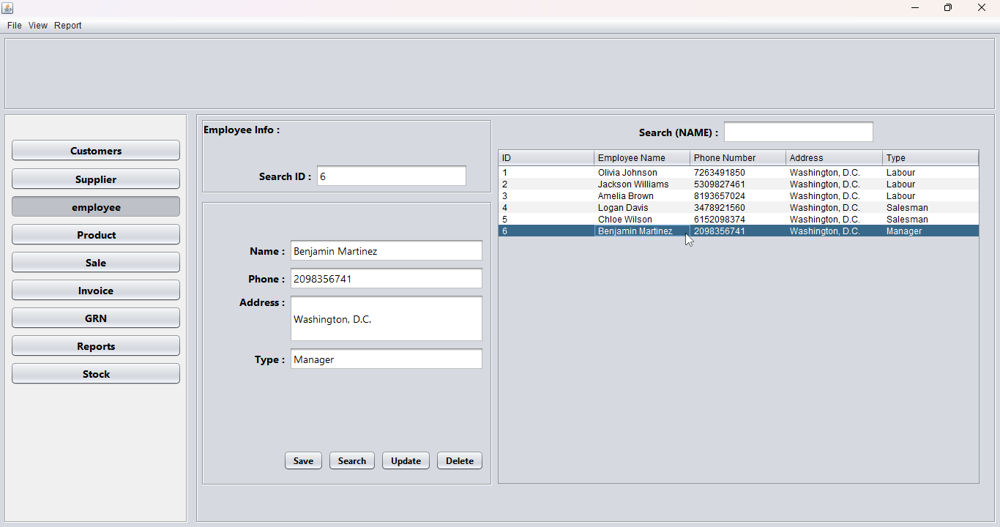
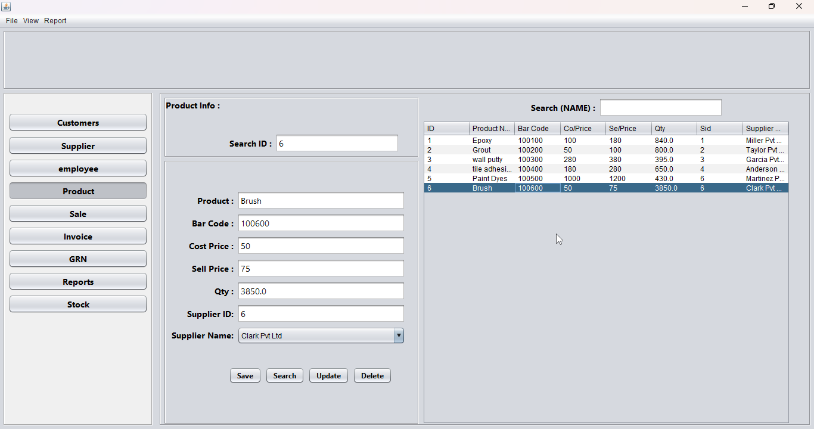
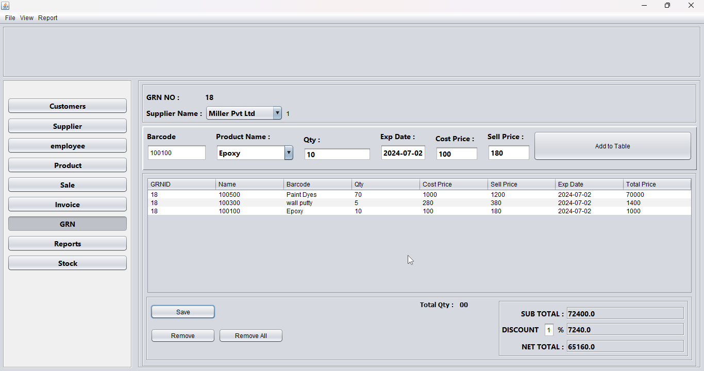
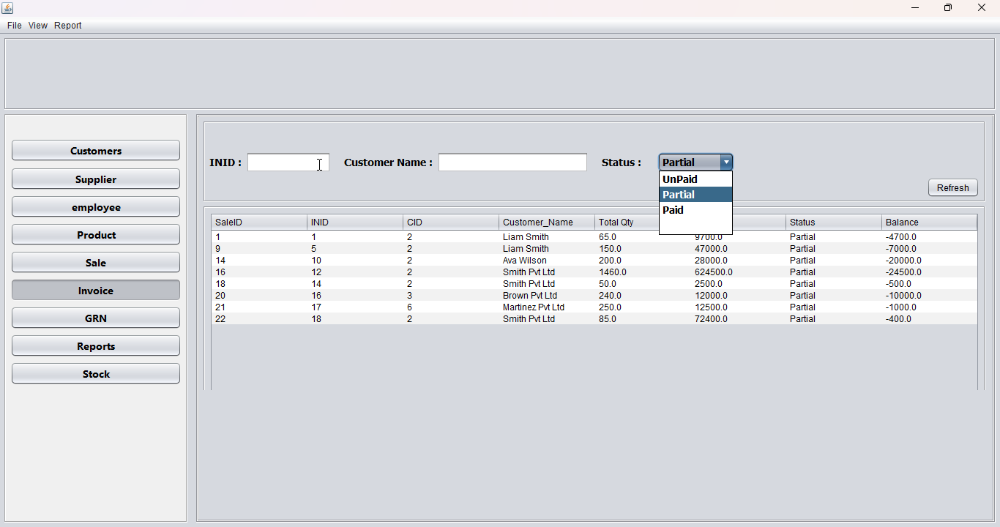
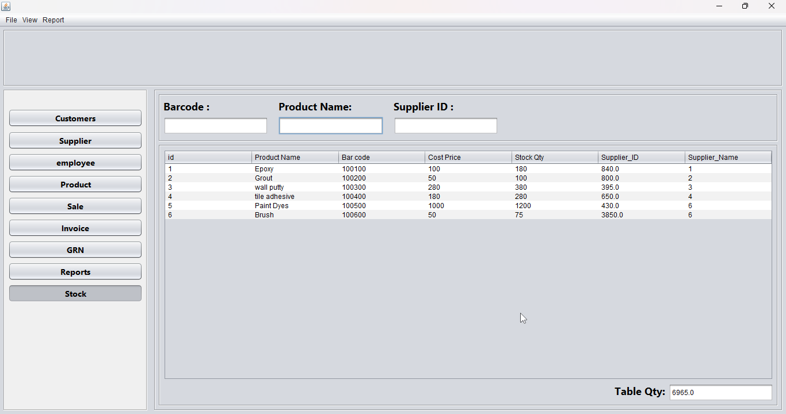

# InvenTrackPro - Comprehensive Inventory Management and Billing Solution

## Introduction

Welcome to InvenTrackPro, an all-in-one solution designed for efficient inventory management and streamlined billing processes. InvenTrackPro enables business owners to maintain comprehensive records and generate detailed reports with ease, ensuring seamless operation and accurate tracking.

## Key Features

- **Customer Management:** Maintain detailed records of customers, including their contact information, purchase history, and preferences. Easily access and update customer data.

- **Supplier Management:** Store and manage supplier information, including contact details, delivery schedules, and payment terms. Maintain strong relationships with suppliers for smooth operations.
  
- **Employee Management:** Manage employee records, including personal information, roles, and performance metrics. Monitor employee activities and access levels within the system.

- **Product Management:** Keep track of product details such as descriptions, prices, stock levels, and categories. Ensure accurate inventory counts and quick retrieval of product information.

- **Billing Solution:** Create new bills with ease, applying discounts, taxes, and other charges as needed. Provide customers with accurate and professional invoices.

- **Invoice Management:** Generate and manage invoices for sales and services. Retrieve old invoices quickly and ensure accurate billing for all transactions.

- **Stock Management:** Track stock levels in real-time, manage stock entries and exits, and set alerts for low stock levels. Ensure optimal inventory levels to meet customer demand without overstocking.
- 
- **Business Reporting:** Generate comprehensive reports on sales, inventory, and overall business performance. Gain insights into trends and make informed decisions to drive growth.

- **User-Friendly Interface:** Enjoy a simple and intuitive interface designed for easy navigation and efficient task management. Perform all operations with just a few clicks.

     

     

      

   
  

    

How to Run the Application
Follow these steps to run the InvenTrackPro application locally:

Clone the Repository
bash
Copy code
git clone https://github.com/sainiparitosh2003/InvenTrackPro.git
cd InvenTrackPro
Install Dependencies
Ensure you have Java installed on your system. Then, compile the project using your preferred build tool (e.g., Maven, Gradle).

bash
Copy code
mvn install
or

bash
Copy code
gradle build
Run the Application
bash
Copy code
java -jar target/InvenTrackPro.jar
or

bash
Copy code
gradle run
This will launch the InvenTrackPro application locally. Open your web browser and navigate to the provided local address to explore and manage your inventory with InvenTrackPro.
